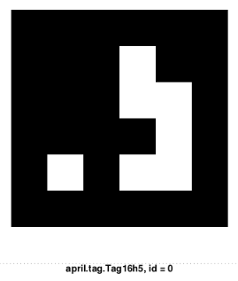

CamTagNavigator
===============

Welcome to CamTagNavigator, a simple but robust solution designed for precise
indoor navigation using a monocamera (e.g. USB webcam) setup and AprilTags. This
application integrates visual tagging (simply printed on paper) with computer
vision techniques to offer a robust and accurate positioning system, akin to an
indoor GPS.

Overview
--------

CamTagNavigator utilizes a single camera to identify AprilTags visual markers
that can be placed within any indoor environment. Each tag is associated with a
unique ID and predefined 3D coordinates, enabling the application to calculate
the camera's position in space with millimeter accuracy, provided the camera is
properly calibrated.

What you need to start:

 * A webcam
 * A printer to print out markers

The system is a bit inspired by the concept of satellite navigation, with AprilTags
serving as the 'satellites' in indoor settings. This approach allows for high
precision in environments where traditional GPS signals are unreliable or
unavailable.

Key Features
------------

 * High Precision Positioning: Achieve millimeter accuracy in locating the camera's position within an indoor space.
 * Easy to Deploy: Simply place (lots of) AprilTags in the environment and use a standard USB webcam for navigation.
 * Versatile Application: Ideal for robotics, augmented reality, and any project requiring precise indoor localization.
 * Open Source: CamTagNavigator is open for contributions and adaptable for various applications.

Compile
-------

Linux:

Make sure you have OpenCV installed:

    sudo apt install libopencv-dev

Create a build directory:

    mkdir build && cd build

Run CMake to configure and generate a Makefile:

    make

Windows:

Create a build directory:

    mkdir build
    cd build

Run CMake to configure your project. You might need to specify the path to your
OpenCV build and adjust for the Visual Studio version you are using:

    cmake -G "Visual Studio 16 2019" -A x64 -DOpenCV_DIR="C:\path\to\opencv\build" ..

This command generates Visual Studio solution files. Open the solution in
Visual Studio, then build the project using the Visual Studio.

First Steps
-----------

Step 1: Print out the tag with id=0 (first page) from doctags/tag16h5.pdf and put it on
a wall.

Calibrate your camera. You can use the python script camcalib.py (make sure you
have OpenCV for Python installed as well).

Print out the calibration pattern PDF:

    camera-calibration-checker-board_9x7.pdf

Make sure that the size of a printed out square matches the following variable in
camcalib.py:

    square_size = 0.021 # = 2.1 cm

Make sure you also have the Python version of OpenCV installed:

    pip3 install opencv

Finally run the calibration script. Press the s key to use an image in the preview window
for the calibration. Collect a bunch of images and finally press q to run the calculation.
Make sure the reprojection error is below 1.0 pixels for acceptable results.

    python3 camcalib.py

Now you should have the calibration data in this file:

    calibration.xml

The next step is to setup the configuration .xml file.  Edit the config file
camtagconfig.xml with your favourite text editor. The following settings are
important.

Camera image size in pixels:

    <width>640</width>
    <height>480</height>

In case you have more than one webcam connected, set the camera index (0 is the
first camera):

    <device_id>0</device_id>

The path to your camera calibration file needs to be specified:

    <calibration>calibration.xml</calibration>

You can switch between different AprilTag codes, default is 16h5:

    <tag_code>"16h5"</tag_code>

Make sure you have a camera connected to your host PC and run the
CamTagNavigator app from the project root directory:

    ./build/camtagnav

It should look something like this:

Marker Coordinates Database
---------------------------

For more than a first steps test scenario you want to print out more markers
and set their coordinates into the markers database.

Setting up entries in marker.txt in the following format:

    ID   lower left           lower right xyz      upper right xyz      upper left xyz

    0    0.000 0.000 0.000    0.149 0.000 0.000    0.149 -0.149 0.000   0.000 -0.149 0.000
    1    ...
    2    ...

Coordinate System
-----------------

         Z-axis
         /
        /
       /
      /
     +-----------> X-axis
     |
     |
     |
     |
     |
     V Y-axis

